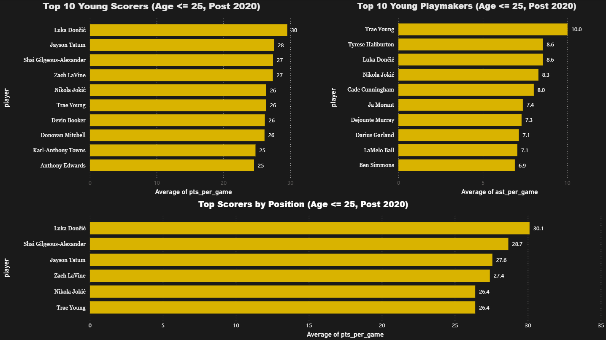

# NBA-young-player-investment-analysis
SQL analysis identifying high-value young NBA players for front office decision making

## 1. Dashboard Preview

## 2. Project Overview
The purpose of this project is to aid NBA executives such as coaches, General Managers, and team owners in situations when they are deciding whether to invest in young players.

## 3. Business Problem
When it is time for franchises to choose young players to invest in it is often involving highly valuable assets such as millions of dollars or draft picks. This project analyzes stats such as points, assists, rebounds and availability based on games played to help front offices identify production habits or injury risks when deciding the needs regarding their next young athlete.

## 4. Objectives
Scoring Analysis- The first query showcases the top 10 scorers in the NBA aged 25 and under after the year 2020.

Playmaking Analysis- The second query showcases the top 10 playmakers in the NBA aged 25 and under after the year 2020 with a 20 game minimum.

Positional Scoring Analysis- The third query showcases the top scorers positionally in the NBA aged 25 and under after the year 2020 with a 41 game minimum.

Playmaking and Scoring Analysis- The fourth query showcases the top 10 scorers and playmakers in the NBA aged 25 and under after the year 2020 with a 41 game minimum.

Positional Rebounding and Scoring Analysis- The fifth query showcased the top scorers and rebounders in the NBA aged 25 and under after year 2020 with a 41 game minimum. 

## 5. Key Findings
Luka Doncic is amongst the most talented young athletes in the NBA ranking highly positionally and universally, averaging (33.9 pts/game, 9.8 ast/game and 9.2 trb/game)
    - With these findings in mind Luka Doncic puts himself in a position to attain a max contract extension.

Trae Young is another exceptionally well rounded player with his best season averaging 28.4 pts/game and 10.8 ast/game.
    - If a General Manager is desiring a point guard that has the ability to playmake and score at a high degree Trae Young would be a good target.

Another standout would be Nikola Jokic based on the data set he seems to be one of the most universal players in the league which is rare for a center, averaging (26.4 pts/game, 8.3 ast/game, 10.8 trb/game)
    - Nikola Jokic would be a highly desirable player since his skillset is very much well-rounded almost guaranteeing him as a valuable asset. 

## 6. Tools Used
SQLite / DB Browser
SQL
Github
PowerBI
## 7. File Structure
    -'top10_young_scorers_post2020.sql' — Top 10 scoring players aged 25 and under post 2020
    -'top10_young_playmakers_post2020.sql' — Top 10 assist leaders aged 25 and under post 2020
    -'top_young_pts_trb_by_position_post2020.sql' - Top 10 scoring and total rebounders aged 25 and under post 2020
    -'top10_young_wellrounded_post2020.sql' - Top 10 scoring and assist leaders aged 25 and under post 2020
    -'top_scorer_by_position_post2020.sql` - Top scoring leaders by position aged 25 and under post 2020
